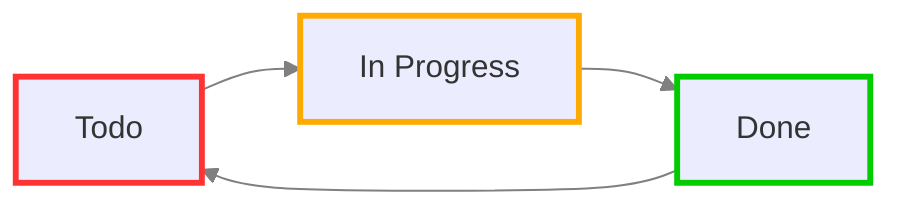
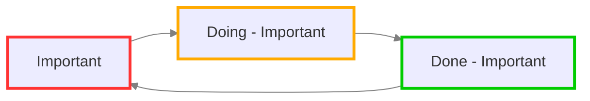
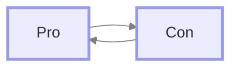
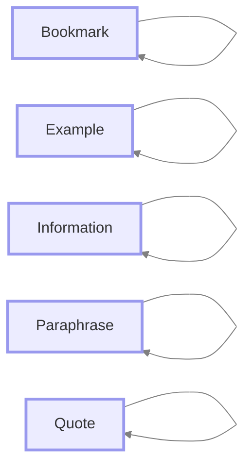

# 示例状态

#feature/statuses

## 概述

一旦我们了解了什么是[[Statuses|状态]]，我们可以用它们做什么？

这里有一些示例场景，供您参考。

## Todo -> In Progress -> Done

您可以调整Tasks的`Todo`状态，使其切换到'In Progress'，然后再切换到'Done'。

如果您有一些稍微耗时的任务需要关注，这可能很有用。也许您希望优先完成正在进行中的事情，然后再开始新的事情？

<!-- include: DocsSamplesForStatuses.test.DefaultStatuses_todo-in_progress-done.approved.mermaid.md -->

<!-- endInclude -->

<!-- placeholder to force blank line before included text --><!-- include: DocsSamplesForStatuses.test.DefaultStatuses_todo-in_progress-done.approved.md -->

| 状态符号 | 下一个状态符号 | 状态名称 | 状态类型 | 需要自定义样式 |
| ----- | ----- | ----- | ----- | ----- |
| `space` | `/` | Todo | `TODO` | No |
| `/` | `x` | In Progress | `IN_PROGRESS` | Yes |
| `x` | `space` | Done | `DONE` | No |

<!-- placeholder to force blank line after included text --><!-- endInclude -->

## 重要任务的单独循环

有时我有一些非常重要的任务，我希望它们从众多任务中脱颖而出，一些主题让`!`任务在视觉上突出显示，所以我发现这真的很有效。

通过为`IN_PROGRESS`和`DONE`状态使用非标准符号，如果我决定稍后重新打开这些已完成任务中的一个，它会自动再次变为`!`。

<!-- include: DocsSamplesForStatuses.test.DefaultStatuses_important-cycle.approved.mermaid.md -->

<!-- endInclude -->

<!-- placeholder to force blank line before included text --><!-- include: DocsSamplesForStatuses.test.DefaultStatuses_important-cycle.approved.md -->

| 状态符号 | 下一个状态符号 | 状态名称 | 状态类型 | 需要自定义样式 |
| ----- | ----- | ----- | ----- | ----- |
| `!` | `D` | Important | `TODO` | Yes |
| `D` | `X` | Doing - Important | `IN_PROGRESS` | Yes |
| `X` | `!` | Done - Important | `DONE` | Yes |

<!-- placeholder to force blank line after included text --><!-- endInclude -->

## 优缺点复选框 - 相互切换

如果我在头脑风暴解决卡住的问题的想法时，写一个优缺点列表有时会有帮助。

幸运的是，一些主题使用`P`和`C`来表示这些。其他的使用`p`和`c`。

无论哪种方式，我都可以让它们相互切换，通过给它们`NON_TASK`类型，我可以将它们从我的Tasks搜索中排除，因为我不认为它们是可执行的。

<!-- include: DocsSamplesForStatuses.test.DefaultStatuses_pro-con-cycle.approved.mermaid.md -->

<!-- endInclude -->

<!-- placeholder to force blank line before included text --><!-- include: DocsSamplesForStatuses.test.DefaultStatuses_pro-con-cycle.approved.md -->

| 状态符号 | 下一个状态符号 | 状态名称 | 状态类型 | 需要自定义样式 |
| ----- | ----- | ----- | ----- | ----- |
| `P` | `C` | Pro | `NON_TASK` | Yes |
| `C` | `P` | Con | `NON_TASK` | Yes |

<!-- placeholder to force blank line after included text --><!-- endInclude -->

## 忽略点击和切换

假设您有一些纯粹用于显示目的的状态：它们绝对不会用于可执行任务，如果您错误地点击一个，您不希望它切换或获得完成日期。

有一个很好的属性，即具有相同状态符号和下一个状态符号的状态 - 以及`DONE`以外的类型 - 在切换时什么都不做。

这里有一些来自ITS主题的状态，其中这种行为可能很有用。

<!-- include: DocsSamplesForStatuses.test.DefaultStatuses_toggle-does-nothing.approved.mermaid.md -->

<!-- endInclude -->

<!-- placeholder to force blank line before included text --><!-- include: DocsSamplesForStatuses.test.DefaultStatuses_toggle-does-nothing.approved.md -->

| 状态符号 | 下一个状态符号 | 状态名称 | 状态类型 | 需要自定义样式 |
| ----- | ----- | ----- | ----- | ----- |
| `b` | `b` | Bookmark | `NON_TASK` | Yes |
| `E` | `E` | Example | `NON_TASK` | Yes |
| `I` | `I` | Information | `NON_TASK` | Yes |
| `P` | `P` | Paraphrase | `NON_TASK` | Yes |
| `Q` | `Q` | Quote | `NON_TASK` | Yes |

<!-- placeholder to force blank line after included text --><!-- endInclude -->
