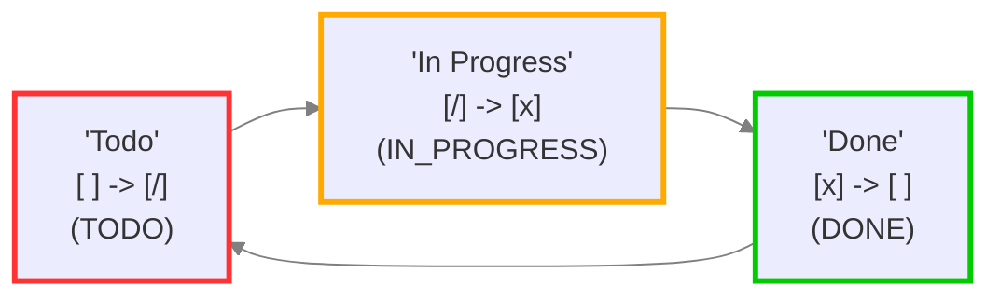
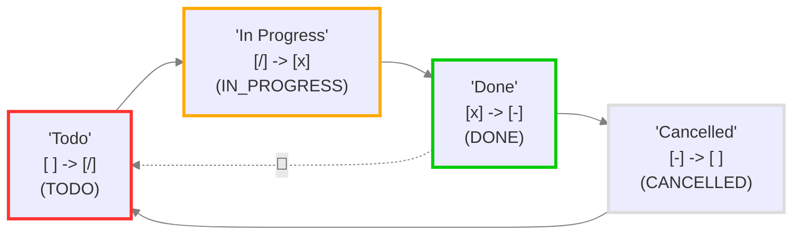
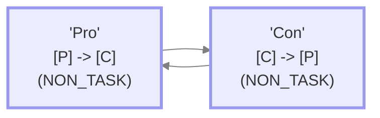

# 重复任务和自定义状态

<span class="related-pages">#feature/statuses</span>

> [!Note]
> 本页面假设您对[[Recurring Tasks|重复任务]]有基本了解。
>
> 此外，对于本页面中的示例，我们调整了Tasks设置，使得[[Recurring Tasks#Order of the new task|新任务重复在前一个任务的*下方*添加。]]

## 确定下一个状态

当您点击任务的复选框时，Tasks插件应用以下逻辑：^[除非任务状态类型为`NON_TASK`。请参阅[[#当前状态类型为NON_TASK时]]的示例。]

1. 当任务行复选框被点击时，会在用户的Task插件的[[Status Settings|状态设置]]中查找下一个状态符号。
2. 如果下一个状态符号的类型是`DONE`：
    - 添加[[Dates#Done date|完成日期]]（如果在用户设置中启用）。
    - 如果任务行有重复规则，会创建一个新任务，使用`DONE`符号后的下一个状态符号。
    - 如果那个下一个状态既不是`TODO`也不是`IN_PROGRESS`，会选择不同的状态。请参阅下面的[[#当DONE后面不跟TODO或IN_PROGRESS时]]。

> [!Important]
> 每次Tasks检测到您点击任务复选框时，插件会读取当前状态符号 - 在`[`和`]`内 - 并在您的Tasks状态设置中查找它，以确定下一个状态符号是什么。

## 实际示例，包含重复任务

### 起始点

假设我们稍微调整了默认的Tasks设置，给我们**以下Tasks状态设置**：

<!-- include: DocsSamplesForStatuses.test.DefaultStatuses_todo-in_progress-done.approved.detailed.mermaid.md -->

<!-- endInclude -->

我们选择了Tasks设置，将[[Recurring Tasks#Order of the new task|新重复任务放在初始任务的下方]]。

现在想象我们有**以下任务行**：

```text
- [ ] Do something 🔁 every day 📅 2023-10-15
```

- 这是一个重复任务。
- 它每天重复。
- 它的到期日期是`2023-10-15`（今天）。

### 第一次点击 - 前进到IN_PROGRESS

**第一次我们点击任务的复选框**或运行Tasks的**切换任务完成**命令时，该行变为：

```text
- [/] Do something 🔁 every day 📅 2023-10-15
```

- 注意`[ ]`变成了`[/]`...
  - ...因为`space`后的下一个状态符号是`/`。
- 从设置中，我们看到状态类型现在是`IN_PROGRESS`。

### 第二次点击 - 前进到DONE并重复

**下一次我们点击任务的复选框**或运行Tasks的**切换任务完成**命令来切换任务时，该行变成**两行**：

```text
- [x] Do something 🔁 every day 📅 2023-10-15 ✅ 2023-10-15
- [ ] Do something 🔁 every day 📅 2023-10-16
```

让我们更详细地看一下。

### 分解结果

让我们看看**这两行中的第一行：**

```text
- [x] Do something 🔁 every day 📅 2023-10-15 ✅ 2023-10-15
```

- 注意`[/]`变成了`[x]`...
  - ...因为`/`后的下一个状态符号是`x`。
- 从设置中，我们看到状态类型现在是`DONE`。
- 所以添加了[[Dates#Done date|完成日期]]（如果在用户设置中启用）。

让我们看看**这两行中的第二行：**

```text
- [ ] Do something 🔁 every day 📅 2023-10-16
```

- 创建这个新任务行是因为：
  - 原始任务有重复规则，
  - 并且其状态类型已前进到`DONE`。
- 注意在新任务行中，状态是`[ ]`...
  - ...因为`x`后的下一个状态符号是`space`。
- 到期日期前进了一天。

## 当DONE后面不跟TODO或IN_PROGRESS时

在以下示例中，`DONE`后面跟着`CANCELLED`。

<!-- include: DocsSamplesForStatuses.test.DefaultStatuses_done-toggles-to-cancelled.approved.detailed.mermaid.md -->

<!-- endInclude -->

> [!important] 下一个重复的状态类型：始终是`TODO`或`IN_PROGRESS`
> 当切换重复任务创建下一个重复时，新任务只能是`TODO`或`IN_PROGRESS`才有意义，这样新任务就能被`not done`搜索找到。）
>
> 上图中带有"recurring"表情符号的虚线箭头表示Tasks将跳过新重复的`Cancelled`状态，并跳转到`Todo`。

这意味着即使任何已完成重复任务的新重复看起来总是`CANCELLED`，任务会查看循环中的其他状态并：

1. 它会跟随箭头，并选择找到的第一个`TODO`状态。
2. 如果没有找到`TODO`，它会再次跟随箭头，并选择找到的第一个`IN_PROGRESS`状态。
3. 如果这也失败了，它将只选择状态符号`space`。

> [!example]
> 例如，当以下任务在具有上图中状态设置的库中被切换时：
>
> ```text
> - [/] Do something 🔁 every day 📅 2024-10-16
> ```
>
> ...它将变成...
>
> ```text
> - [x] Do something 🔁 every day 📅 2024-10-16 ✅ 2023-10-16
> - [ ] Do something 🔁 every day 📅 2024-10-17
> ```
>
> 注意新任务有`TODO`状态，所以它会出现在标准Tasks搜索中。

> [!released]
> 这种改进的新重复状态选择在Tasks 5.4.0中引入。

## 当前状态类型为NON_TASK时

[[Status Types#NON_TASK|NON_TASK]]是一个特殊的状态类型，用于不代表任务的检查清单。

<!-- include: DocsSamplesForStatuses.test.DefaultStatuses_pro-con-cycle.approved.detailed.mermaid.md -->

<!-- endInclude -->

在Tasks设置中有上述自定义状态时，点击带有`[P]`和`[C]`复选框的任务行将：

- 永远不会添加完成日期
- 永远不会创建新实例，即使任务行有重复规则。
