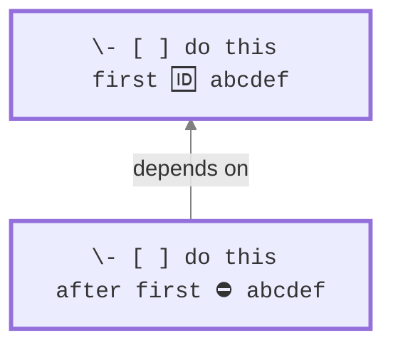
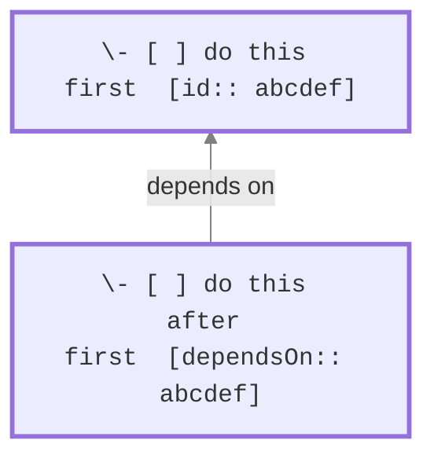

# 任务依赖

## 介绍

> [!released]
> 任务依赖在Tasks 6.1.0中引入。

在高层次上，任务依赖定义了您希望处理一组任务的顺序。
这对于规划项目很有用，其中一个部分需要在另一个部分之前完成。
通过指定这些依赖关系，Obsidian Tasks可以通过仅显示在任何给定时刻可操作的任务来简化您的工作流程。

> [!NOTE]
> Tasks插件专门允许"完成到开始(FS)"依赖关系，意味着任务A需要在您开始任务B之前完成。您可以在[Wikipedia](https://en.wikipedia.org/wiki/Dependency_(project_management))上了解更多关于这个概念的信息。

> [!Tip]
> 本页面解释了依赖关系功能以及如何使用它。
>
> 有关如何在任务之间添加和编辑依赖关系的说明，请参阅[[Create or edit Task#Dependencies|创建或编辑任务#依赖关系]]。

## 示例依赖

这是一个示例依赖关系，告诉Tasks ==第二个任务在第一个任务完成之前无法开始==：

### Tasks表情符号格式示例

- 第一个任务有一个值为`abcdef`的**`id`**字段。
- 第二个任务有一个**`dependsOn`**，其值相同为`abcdef`，是对第一个任务的引用或指针。



### Dataview格式示例

在Dataview格式中，上述内容将写成：



## 定义依赖关系

### `id`

任务`id`值由**以下允许字符中的一个或多个**组成：

- `abcdefghijklmnopqrstuvwxyz`
- `ABCDEFGHIJKLMNOPQRSTUVWXYZ`
- `0123456789`
- 下划线（`_`）
- 连字符（`-`）

以下是有效`id`值的示例：

- `1`
- `2`
- `hftw84745`
- `task_1`
- `do-me-first`

任务`id`值旨在**在整个库中唯一**，每个不同的`id`仅用于一个任务。但是，没有对此进行检查。

%%
#### 重复的`id`值

此部分暂时注释掉，因为虽然搜索能很好地处理具有重复`id`的任务，但编辑任务模态框在任务依赖于相同`id`多次时没有明确说明。

任务`id`值*旨在*在整个库中唯一。

但是，依赖于在您的库中多次出现的`id`的任务将依赖于*所有*这些其他任务。如果您想快速使一个任务依赖于一长串其他任务，您可以利用这一点。
%%

### `dependsOn`

任务`dependsOn`值包含：

- 其他任务的一个或多个`id`值
- 用逗号（`,`）分隔，允许可选空格。

以下是有效的`dependsOn`值：

- `1`
- `dcf64c,0h17ye`
- `dcf64c, 0h17ye`

## 编辑依赖关系

下面是一个工作示例，演示添加一个依赖关系。

有关如何在任务之间添加和编辑依赖关系的更详细说明，请参阅[[Create or edit Task#Dependencies|创建或编辑任务#依赖关系]]和[[Auto-Suggest#Details|自动建议#详细信息]]。

### 工作示例

为了说明任务依赖关系的概念，让我们考虑一个场景，我们正在概述开发应用程序所需的任务。确定了两个任务：

```text
- [ ] Build a first draft
- [ ] Test with users
```

在这种情况下，与用户测试只能在初始草稿完成后进行。要建立这种关系，您可以使用以下任一方法在两个任务之间创建依赖关系。

#### 选项1：使用编辑任务模态框

使用[[Create or edit Task|创建或编辑任务]]模态框，您可以：

1. **要么：**
    - 在编辑任务模态框中打开**'Build a first draft'**任务
    - 并在**After this**中指定**'Test with users'**。
1. **或者：**
    - 在编辑任务模态框中打开**'Test with users'**任务
    - 并在**Before this**中添加**'Build a first draft'**。


<span class="caption">使**'Test with users'**任务依赖于**'Build a first draft'**任务。</span>

#### 选项2：使用自动建议功能

使用[[Auto-Suggest|自动建议]]功能，在**源码模式**或**实时预览**中，您可以在不离开编辑器的情况下添加依赖关系：

> [!Tip]
> 如果您想控制使用的`id`，这是一个可选的第一步：
>
> 1. 点击`Build a first draft`的末尾。
> 1. 开始输入`id`并选择`🆔 id`。
> 1. 然后有两个选项：
>     - 您可以选择`generate unique id`来自动生成ID。
>     - 或者您可以指定自己的ID。

创建依赖关系：

1. 点击`Test with users`行的末尾。
1. 开始输入`id`或`dep`，并选择`⛔ depends on id`。
1. 开始输入它应该依赖的任务（`Build a first draft`）
1. 点击`Build a first draft`任务，添加依赖关系。
1. 按回车键。如果没有输入ID，将为任务生成一个ID。

> [!info]
> 选择`⛔ depends on id`时：
>
> - 要依赖多个任务，在现有`depends on`值的最后一个id后输入逗号，然后选择另一个任务。
> - 它只搜索/显示未完成任务的描述。
> - 它最初过滤显示同一文件中的任务（"更接近"任务），但如果您输入更多文本，它将搜索库中所有未完成的任务。
> - 不要在任务之间创建循环依赖。

#### 结果

通过实施任何这些方法，任务列表将更新以反映依赖关系：

```text
- [ ] Build a first draft 🆔 4ijuhy
- [ ] Test with users ⛔ 4ijuhy
```

然后，如果使用查询`is not blocked`

    ```tasks
    is not blocked
    ```

我们只看到'Build a first draft'

```text
- [ ] Build a first draft 🆔 4ijuhy
```

直到此任务被标记为完成，此时Obsidian Tasks看到'Test with users'不再被阻塞，并也显示它

```text
- [x] Build a first draft 🆔 4ijuhy
- [ ] Test with users ⛔ 4ijuhyz
```

## 搜索概念

`id`和`dependsOn`表示任务之间的依赖排序关系，即任务应该完成的顺序。

在搜索中使用这些依赖关系时，我们定义了另外两种关系：`blocking`和`blocked`。

### 阻塞任务

> [!Summary]
> 任务在以下情况下是`blocking`的：
>
> 1. 它们尚未完成
> 2. 并且至少有一个其他任务**直接依赖于它们**，该任务也尚未完成。
>
> 您可能希望首先处理阻塞任务，以便解除后续任务的阻塞。

任务是`blocking`的，如果：

- 它是`TODO`或`IN_PROGRESS`。
- 并且**直接依赖于它**的任何任务也是`TODO`或`IN_PROGRESS`。

请注意：

- 只考虑直接依赖关系。
- 状态类型为`DONE`、`CANCELLED`或`NON_TASK`的任务永远不会被视为`blocking`。

搜索`blocking`任务：

````text
```tasks
is blocking
```
````

### 被阻塞任务

> [!Summary]
> 任务在以下情况下是`blocked`的：
>
> 1. 它们尚未完成
> 2. 并且至少有一个其他任务**它们直接依赖的**，该任务也尚未完成。
>
> 它们还不能被处理。

任务是`blocked`的，如果：

- 它是`TODO`或`IN_PROGRESS`。
- 并且**它直接依赖的**任何任务也是`TODO`或`IN_PROGRESS`。

请注意：

- 只考虑直接依赖关系。
- 状态类型为`DONE`、`CANCELLED`或`NON_TASK`的任务永远不会被视为`blocked`。

搜索`blocked`任务：

````text
```tasks
is blocked
```
````

### 非阻塞任务

要查找**不**`blocked`且*可以*操作的任务，使用：

````text
```tasks
not done
is not blocked
```
````

### 阻塞和被阻塞的演示

> [!Example] 发生阻塞
> 如果`dependsOn`链接的*两端*都是`TODO`或`IN_PROGRESS`，则发生阻塞：
>
> ```mermaid
> flowchart BT
>
> classDef TASK        stroke-width:3px,font-family:monospace;
>
> 2["\- [ ] this is blocking  🆔 abcdef"]:::TASK
> 1["\- [ ] this is blocked&nbsp ⛔ abcdef"]:::TASK
> 1-- depends on --> 2
>
> linkStyle default stroke:gray
> ```

> [!Example] 无阻塞
> 如果`dependsOn`链接的*任一端*是`DONE`、`CANCELLED`或`NON_TASK`，则不发生阻塞：
>
> ```mermaid
> flowchart BT
>
> classDef TASK        stroke-width:3px,font-family:monospace;
>
> 4["\- [ ] not blocking  🆔 abcdef"]:::TASK
> 3["\- [x] not blocked&nbsp ⛔ abcdef"]:::TASK
> 3-- depends on --> 4
>
> linkStyle default stroke:gray
> ```

> [!Example] 混合情况
> 任务只有在它`dependsOn`的*所有*任务都已`DONE`或`CANCELLED`（或标记为`NON_TASK`）时才会解除阻塞：
>
> ```mermaid
> flowchart BT
>
> classDef TASK        stroke-width:3px,font-family:monospace;
>
> 5["\- [x] not blocking  🆔 abcdef"]:::TASK
> 4["\- [ ] blocking 🆔 ghijkl"]:::TASK
> 3["\- [ ] blocked ⛔ abcdef,ghijkl"]:::TASK
> 3-- depends on --> 5
> 3-- depends on --> 4
>
> linkStyle default stroke:gray
> ```

## 在Tasks搜索中使用依赖关系

### 过滤器

与任务依赖关系相关的内置过滤器有：

```text
is blocking
is not blocking
is blocked
is not blocked

has id
no id
id (includes|does not include) <string>
id (regex matches|regex does not match) /<JavaScript-style Regex>/

has depends on
no depends on
```

详细信息请参阅[[Filters#Filters for Task Dependencies|任务依赖关系过滤器]]。

### 排序

与任务依赖关系相关的唯一内置排序指令是：

```text
sort by id
```

请参阅[[Sorting#Sort by Task Dependencies|按任务依赖关系排序]]。

### 分组

与任务依赖关系相关的唯一内置分组指令是：

```text
group by id
```

请参阅[[Grouping#Group by Task Dependencies|按任务依赖关系分组]]。

### 任务属性

请参阅[[Task Properties#Values for Task Dependencies|任务依赖关系的任务属性值]]。

## 已知限制

添加依赖关系：

- 使用编辑任务模态框，一次添加大量依赖关系（可能4个或更多）可能会导致错误和一些损坏的依赖关系。我们在[issue #3252](https://github.com/obsidian-tasks-group/obsidian-tasks/issues/3252)中跟踪此问题。

可视化依赖关系：

- 还无法直接从任务导航到它依赖的任务。
- 在编辑任务模态框之外，无法看到阻塞任务的描述。
- 还无法在任何类型的图形视图中可视化关系。

搜索和依赖关系：

- [[Urgency|紧急度]]分数不考虑任务依赖关系。我们在[issue #2655](https://github.com/obsidian-tasks-group/obsidian-tasks/issues/2655)中跟踪此问题。

依赖关系和重复任务：

- 当[[recurring tasks|重复任务]]完成时，下一次重复将有意删除任何`id`和`dependsOn`值。
  - 请参阅[[Recurring Tasks#Next recurrence has any dependency fields removed|下次重复删除任何依赖字段]]
