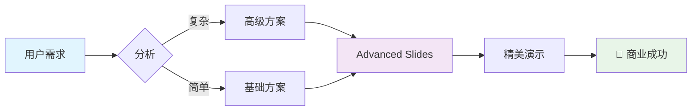

<!-- slide bg="linear-gradient(135deg, #667eea 0%, #764ba2 100%)" -->

# <span style="font-size: 4em; background: linear-gradient(45deg, #FFD700, #FFA500); -webkit-background-clip: text; -webkit-text-fill-color: transparent; text-shadow: 2px 2px 4px rgba(0,0,0,0.5);">✨ Advanced Slides</span>

## <span style="color: #FFD700; font-size: 2em;">极致演示体验</span>

### <span style="color: #E6E6FA; opacity: 0.9;">将 Obsidian 变身为专业演示利器</span>

<div style="margin-top: 50px;">
  <span style="background: rgba(255,255,255,0.1); padding: 15px 30px; border-radius: 50px; border: 2px solid #FFD700; color: #FFD700; font-weight: bold;">🚀 开启精彩之旅</span>
</div>

note: 欢迎来到 Advanced Slides 的精美演示世界

---

<!-- slide bg="https://images.unsplash.com/photo-1557804506-669a67965ba0?ixlib=rb-4.0.3&auto=format&fit=crop&w=2074&q=80" transition="zoom" -->

<div style="background: rgba(0,0,0,0.7); padding: 40px; border-radius: 20px; backdrop-filter: blur(10px);">

# <span style="color: #00D4FF; font-size: 3.5em;">🎯 核心功能</span>

<grid drag="45 80" drop="5 20" style="background: linear-gradient(135deg, rgba(255,107,107,0.9), rgba(255,142,83,0.9)); border-radius: 15px; padding: 30px; box-shadow: 0 10px 30px rgba(0,0,0,0.3);">

## <span style="color: white; font-size: 2em;">🎨 视觉设计</span>

- ✨ 渐变背景与视差滚动
- 🖼️ 高清图片背景
- 🌈 自定义色彩方案
- 💫 流畅动画效果

</grid>

<grid drag="45 80" drop="50 20" style="background: linear-gradient(135deg, rgba(74,144,226,0.9), rgba(80,170,204,0.9)); border-radius: 15px; padding: 30px; box-shadow: 0 10px 30px rgba(0,0,0,0.3);">

## <span style="color: white; font-size: 2em;">⚡ 交互体验</span>

- 🎪 分段显示动画
- 🔄 多种转场效果
- 📱 触控手势支持
- 🎬 演讲者视图

</grid>

</div>

---

<!-- slide bg="https://images.unsplash.com/photo-1451187580459-43490279c0fa?ixlib=rb-4.0.3&auto=format&fit=crop&w=2072&q=80" transition="slide-in fade-out" -->

<div style="background: linear-gradient(135deg, rgba(17,24,39,0.95), rgba(31,41,55,0.95)); padding: 50px; border-radius: 25px; border: 3px solid #60A5FA; backdrop-filter: blur(15px); box-shadow: 0 25px 50px rgba(0,0,0,0.5);">

# <span style="background: linear-gradient(45deg, #60A5FA, #34D399); -webkit-background-clip: text; -webkit-text-fill-color: transparent; font-size: 3.5em;">🏗️ 布局系统</span>

<grid drag="30 70" drop="5 25" style="background: linear-gradient(135deg, #8B5CF6, #A855F7); border-radius: 20px; padding: 25px; transform: perspective(1000px) rotateY(-5deg); box-shadow: 10px 10px 30px rgba(0,0,0,0.3);">

## <span style="color: white; font-size: 1.8em;">📐 网格布局</span>

- 精确定位控制
- 响应式设计
- 3D 视觉效果
- 弹性容器

</grid>

<grid drag="30 70" drop="37.5 25" style="background: linear-gradient(135deg, #F59E0B, #EF4444); border-radius: 20px; padding: 25px; transform: perspective(1000px) rotateY(0deg) rotateX(5deg); box-shadow: 10px 10px 30px rgba(0,0,0,0.3);">

## <span style="color: white; font-size: 1.8em;">🎭 多栏分布</span>

- 双栏对比布局
- 三栏均匀分配
- 自由组合排列
- 视觉层次清晰

</grid>

<grid drag="30 70" drop="65 25" style="background: linear-gradient(135deg, #10B981, #059669); border-radius: 20px; padding: 25px; transform: perspective(1000px) rotateY(5deg); box-shadow: 10px 10px 30px rgba(0,0,0,0.3);">

## <span style="color: white; font-size: 1.8em;">🎨 自定义样式</span>

- CSS 完全控制
- 动态背景效果
- 字体渐变处理
- 阴影投射效果

</grid>

</div>

---

<!-- slide bg="https://images.unsplash.com/photo-1558618047-3c8c76ca7d13?ixlib=rb-4.0.3&auto=format&fit=crop&w=2070&q=80" transition="concave" -->

<div style="text-align: center; color: white;">

# <span style="font-size: 4em; text-shadow: 3px 3px 6px rgba(0,0,0,0.8); background: linear-gradient(45deg, #FF6B6B, #4ECDC4, #45B7D1, #96CEB4, #FFEAA7); -webkit-background-clip: text; -webkit-text-fill-color: transparent; animation: rainbow 3s ease-in-out infinite alternate;">🎪 动画展示</span>

<div style="margin-top: 60px;">

<div style="display: inline-block; margin: 20px; padding: 30px; background: rgba(255,255,255,0.1); border-radius: 15px; backdrop-filter: blur(10px); border: 2px solid rgba(255,255,255,0.2);" class="fragment fade-up">
  <span style="font-size: 3em;">🌟</span><br>
  <span style="font-size: 1.5em; color: #FFD700;">淡入向上</span>
</div>

<div style="display: inline-block; margin: 20px; padding: 30px; background: rgba(255,255,255,0.1); border-radius: 15px; backdrop-filter: blur(10px); border: 2px solid rgba(255,255,255,0.2);" class="fragment fade-right">
  <span style="font-size: 3em;">🚀</span><br>
  <span style="font-size: 1.5em; color: #00D4FF;">向右滑入</span>
</div>

<div style="display: inline-block; margin: 20px; padding: 30px; background: rgba(255,255,255,0.1); border-radius: 15px; backdrop-filter: blur(10px); border: 2px solid rgba(255,255,255,0.2);" class="fragment zoom-in">
  <span style="font-size: 3em;">💫</span><br>
  <span style="font-size: 1.5em; color: #FF6B9D;">缩放进入</span>
</div>

<div style="display: inline-block; margin: 20px; padding: 30px; background: rgba(255,255,255,0.1); border-radius: 15px; backdrop-filter: blur(10px); border: 2px solid rgba(255,255,255,0.2);" class="fragment highlight-red">
  <span style="font-size: 3em;">✨</span><br>
  <span style="font-size: 1.5em; color: #90EE90;">高亮强调</span>
</div>

</div>

<div style="margin-top: 60px; font-size: 1.5em; color: #E6E6FA;" class="fragment fade-in">
  🎭 每个元素都可以拥有独特的出场方式
</div>

</div>

---

<!-- slide bg="https://images.unsplash.com/photo-1506905925346-21bda4d32df4?ixlib=rb-4.0.3&auto=format&fit=crop&w=2070&q=80" transition="zoom" -->

<grid drag="100 20" drop="0 0" style="background: linear-gradient(135deg, rgba(139,69,19,0.9), rgba(160,82,45,0.9)); border-radius: 0 0 50px 50px; padding: 30px; text-align: center; box-shadow: 0 10px 30px rgba(0,0,0,0.5);">
  <h1 style="color: #FFD700; font-size: 3.5em; margin: 0; text-shadow: 2px 2px 4px rgba(0,0,0,0.8);">📊 数据可视化</h1>
</grid>

<grid drag="45 60" drop="5 25" style="background: rgba(255,255,255,0.95); border-radius: 20px; padding: 30px; box-shadow: 0 15px 35px rgba(0,0,0,0.3);">

## <span style="color: #2563EB; font-size: 2.2em;">📈 Mermaid 图表</span>



</grid>

<grid drag="45 60" drop="52 25" style="background: rgba(17,24,39,0.95); border-radius: 20px; padding: 30px; border: 2px solid #60A5FA; box-shadow: 0 15px 35px rgba(0,0,0,0.3);">

## <span style="color: #60A5FA; font-size: 2.2em;">🧮 数学公式</span>

<div style="color: white; font-size: 1.2em; margin: 20px 0;">
演示效果评分公式：
</div>

<div style="color: #34D399; font-size: 1.8em; margin: 30px 0;">
$$\text{美感} = \frac{\text{设计}^2 + \text{动画} \times \text{布局}}{\text{复杂度}} + \text{创意}$$
</div>

<div style="color: #FBBF24; font-size: 1.1em;">
当 Advanced Slides 参数达到最优时：
$$\lim_{t \to \infty} \text{演示效果} = \text{完美}$$
</div>

</grid>

---

<!-- slide bg="https://images.unsplash.com/photo-1519389950473-47ba0277781c?ixlib=rb-4.0.3&auto=format&fit=crop&w=2070&q=80" transition="convex" -->

<div style="background: linear-gradient(135deg, rgba(0,0,0,0.8), rgba(31,41,55,0.8)); padding: 50px; border-radius: 30px; border: 3px solid #10B981; backdrop-filter: blur(20px); box-shadow: 0 30px 60px rgba(0,0,0,0.6);">

# <span style="color: #10B981; font-size: 3.5em; text-shadow: 2px 2px 4px rgba(0,0,0,0.8);">💼 实战应用</span>

<div style="margin-top: 40px;">

<div style="display: flex; justify-content: space-between; flex-wrap: wrap; gap: 30px;">

<div style="flex: 1; min-width: 300px; background: linear-gradient(135deg, #667eea, #764ba2); border-radius: 20px; padding: 30px; text-align: center; transform: perspective(1000px) rotateY(-10deg); box-shadow: 15px 15px 30px rgba(0,0,0,0.4);" class="fragment fade-up">
  <div style="font-size: 4em; margin-bottom: 20px;">🎓</div>
  <h3 style="color: white; font-size: 1.8em; margin-bottom: 15px;">教育培训</h3>
  <p style="color: #E6E6FA; font-size: 1.1em;">课程内容生动展示<br>学员注意力持续集中<br>知识点层层递进</p>
</div>

<div style="flex: 1; min-width: 300px; background: linear-gradient(135deg, #f093fb, #f5576c); border-radius: 20px; padding: 30px; text-align: center; transform: perspective(1000px) rotateY(0deg); box-shadow: 15px 15px 30px rgba(0,0,0,0.4);" class="fragment fade-up" data-fragment-index="1">
  <div style="font-size: 4em; margin-bottom: 20px;">🏢</div>
  <h3 style="color: white; font-size: 1.8em; margin-bottom: 15px;">商业汇报</h3>
  <p style="color: #FFE6E6; font-size: 1.1em;">数据图表专业呈现<br>决策方案清晰对比<br>客户印象深刻难忘</p>
</div>

<div style="flex: 1; min-width: 300px; background: linear-gradient(135deg, #4facfe, #00f2fe); border-radius: 20px; padding: 30px; text-align: center; transform: perspective(1000px) rotateY(10deg); box-shadow: 15px 15px 30px rgba(0,0,0,0.4);" class="fragment fade-up" data-fragment-index="2">
  <div style="font-size: 4em; margin-bottom: 20px;">🚀</div>
  <h3 style="color: white; font-size: 1.8em; margin-bottom: 15px;">产品发布</h3>
  <p style="color: #E6F9FF; font-size: 1.1em;">功能特性动态展示<br>用户体验流畅演示<br>品牌形象专业提升</p>
</div>

</div>

</div>

<div style="margin-top: 50px; text-align: center;" class="fragment fade-in" data-fragment-index="3">
  <span style="background: linear-gradient(45deg, #FFD700, #FFA500); padding: 15px 40px; border-radius: 50px; color: #000; font-weight: bold; font-size: 1.3em; box-shadow: 0 10px 25px rgba(255,215,0,0.4);">✨ 让每次演示都成为艺术品</span>
</div>

</div>

---

<!-- slide bg="https://images.unsplash.com/photo-1486312338219-ce68e2c6b4d3?ixlib=rb-4.0.3&auto=format&fit=crop&w=2072&q=80" transition="zoom" -->

<div style="background: rgba(0,0,0,0.85); padding: 60px; border-radius: 25px; backdrop-filter: blur(15px); border: 2px solid #8B5CF6; box-shadow: 0 25px 50px rgba(0,0,0,0.7);">

# <span style="background: linear-gradient(45deg, #8B5CF6, #EC4899); -webkit-background-clip: text; -webkit-text-fill-color: transparent; font-size: 3.5em;">🛠️ 高级技巧</span>

<grid drag="48 70" drop="2 25" style="background: linear-gradient(135deg, rgba(59,130,246,0.9), rgba(147,51,234,0.9)); border-radius: 20px; padding: 30px; box-shadow: 0 15px 30px rgba(0,0,0,0.4);">

## <span style="color: white; font-size: 2em;">⌨️ 快捷操作</span>

<div style="color: #E6E6FA; font-size: 1.2em; line-height: 1.8;">

- <span style="background: rgba(255,255,255,0.2); padding: 5px 10px; border-radius: 8px; margin-right: 10px;">F</span> 全屏模式 <!-- element class="fragment fade-in-then-semi-out" -->
- <span style="background: rgba(255,255,255,0.2); padding: 5px 10px; border-radius: 8px; margin-right: 10px;">S</span> 演讲者视图 <!-- element class="fragment fade-in-then-semi-out" -->
- <span style="background: rgba(255,255,255,0.2); padding: 5px 10px; border-radius: 8px; margin-right: 10px;">ESC</span> 幻灯片概览 <!-- element class="fragment fade-in-then-semi-out" -->
- <span style="background: rgba(255,255,255,0.2); padding: 5px 10px; border-radius: 8px; margin-right: 10px;">B</span> 黑屏暂停 <!-- element class="fragment fade-in-then-semi-out" -->

</div>

</grid>

<grid drag="48 70" drop="52 25" style="background: linear-gradient(135deg, rgba(236,72,153,0.9), rgba(251,191,36,0.9)); border-radius: 20px; padding: 30px; box-shadow: 0 15px 30px rgba(0,0,0,0.4);">

## <span style="color: white; font-size: 2em;">🎨 样式秘籍</span>

<div style="color: #FFF; font-size: 1.1em; line-height: 1.6;">

```css
/* 渐变文字效果 */
background: linear-gradient(45deg, #FF6B6B, #4ECDC4);
-webkit-background-clip: text;
-webkit-text-fill-color: transparent;

/* 毛玻璃效果 */
backdrop-filter: blur(10px);
background: rgba(255,255,255,0.1);

/* 3D变换 */
transform: perspective(1000px) rotateY(-10deg);
```

</div>

</grid>

<div style="margin-top: 40px; text-align: center;" class="fragment zoom-in">
  <span style="font-size: 1.5em; color: #FBBF24; text-shadow: 2px 2px 4px rgba(0,0,0,0.5);">🌟 掌握这些技巧，你就是演示大师！</span>
</div>

</div>

---

<!-- slide bg="https://images.unsplash.com/photo-1419242902214-272b3f66ee7a?ixlib=rb-4.0.3&auto=format&fit=crop&w=2013&q=80" transition="slide" -->

<div style="text-align: center; color: white; background: rgba(0,0,0,0.7); padding: 60px; border-radius: 30px; backdrop-filter: blur(20px); border: 3px solid #60A5FA; box-shadow: 0 30px 60px rgba(0,0,0,0.8);">

# <span style="font-size: 5em; background: linear-gradient(45deg, #FFD700, #FFA500, #FF6B6B, #4ECDC4); -webkit-background-clip: text; -webkit-text-fill-color: transparent; text-shadow: 3px 3px 6px rgba(0,0,0,0.8);">🎊 结语</span>

<div style="margin: 50px 0; font-size: 1.8em; color: #E6E6FA; line-height: 1.6;" class="fragment fade-up">
  <span style="color: #60A5FA; font-weight: bold;">Advanced Slides</span> 不仅仅是一个演示工具<br>
  它是您<span style="color: #34D399; font-weight: bold;">创意表达</span>的无限舞台
</div>

<div style="margin: 50px 0;" class="fragment zoom-in">
  <div style="background: linear-gradient(135deg, #667eea, #764ba2); padding: 30px; border-radius: 20px; display: inline-block; box-shadow: 0 15px 35px rgba(0,0,0,0.5);">
    <span style="font-size: 2.5em; color: #FFD700;">✨ 从今天开始</span><br>
    <span style="font-size: 1.8em; color: white;">让每一次演示都震撼人心</span>
  </div>
</div>

<div style="margin-top: 60px; display: flex; justify-content: center; gap: 40px; flex-wrap: wrap;" class="fragment fade-in">
  
  <div style="background: rgba(255,255,255,0.1); padding: 20px 30px; border-radius: 15px; border: 2px solid #10B981;">
    <span style="font-size: 2em;">🚀</span><br>
    <span style="color: #10B981; font-weight: bold;">开始创造</span>
  </div>
  
  <div style="background: rgba(255,255,255,0.1); padding: 20px 30px; border-radius: 15px; border: 2px solid #F59E0B;">
    <span style="font-size: 2em;">💡</span><br>
    <span style="color: #F59E0B; font-weight: bold;">持续创新</span>
  </div>
  
  <div style="background: rgba(255,255,255,0.1); padding: 20px 30px; border-radius: 15px; border: 2px solid #EF4444;">
    <span style="font-size: 2em;">🎯</span><br>
    <span style="color: #EF4444; font-weight: bold;">完美演示</span>
  </div>

</div>

<div style="margin-top: 50px; font-size: 1.3em; color: #FBBF24; font-style: italic;" class="fragment fade-in">
  "优秀的演示不仅传达信息，更能激发灵感与行动"
</div>

</div>

---

<!-- slide bg="linear-gradient(135deg, #1e3c72 0%, #2a5298 100%)" class="end-slide" -->

<div style="text-align: center; padding: 80px 40px;">

<div style="font-size: 6em; margin-bottom: 30px;" class="fragment zoom-in">
  🙏
</div>

<h1 style="font-size: 4em; color: #FFD700; text-shadow: 3px 3px 6px rgba(0,0,0,0.8); margin-bottom: 40px;" class="fragment fade-up">谢谢观看</h1>

<div style="font-size: 1.8em; color: #E6E6FA; margin-bottom: 50px; line-height: 1.6;" class="fragment fade-up" data-fragment-index="1">
  希望这个演示能够激发您的创作灵感<br>
  <span style="color: #60A5FA;">让我们一起创造更美好的演示体验</span>
</div>

<div style="background: rgba(255,255,255,0.1); padding: 30px; border-radius: 20px; backdrop-filter: blur(10px); border: 2px solid rgba(255,255,255,0.2); display: inline-block; margin-top: 40px;" class="fragment fade-in" data-fragment-index="2">
  <div style="font-size: 1.4em; color: #FBBF24; margin-bottom: 15px;">📧 联系方式</div>
  <div style="color: #E6E6FA; font-size: 1.2em;">
    有任何问题或建议，欢迎随时交流讨论<br>
    <span style="color: #34D399;">让我们共同推进演示艺术的边界</span>
  </div>
</div>

<div style="margin-top: 60px; font-size: 1.1em; color: #94A3B8;" class="fragment fade-in" data-fragment-index="3">
  <em>Powered by Advanced Slides & Obsidian</em>
</div>

</div>

<style>
@keyframes rainbow {
  0% { filter: hue-rotate(0deg); }
  100% { filter: hue-rotate(360deg); }
}

.end-slide {
  background-attachment: fixed !important;
}
</style>
