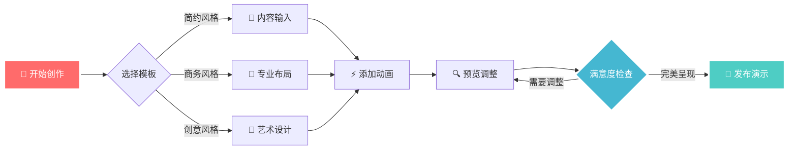

<!-- slide bg="linear-gradient(135deg, #667eea 0%, #764ba2 100%)" class="title-slide" -->

<grid drag="100 30" drop="0 25" align="center">

# 🚀 Advanced Slides
## *创造令人惊艳的演示体验*

</grid>

<grid drag="60 15" drop="20 60" align="center" style="font-size: 1.2em; color: rgba(255,255,255,0.8);">

**从 Markdown 到专业级 PPT 的完美转换** <!-- element class="fragment fade-up" -->

</grid>

<grid drag="40 8" drop="30 75" align="center" style="font-size: 0.9em; color: rgba(255,255,255,0.6);">

基于 Reveal.js • 无限可能 <!-- element class="fragment fade-up" data-fragment-index="1" -->

</grid>

---

<!-- slide bg="linear-gradient(45deg, #1e3c72 0%, #2a5298 100%)" -->

<grid drag="100 100" drop="0 0" style="display: flex; flex-direction: column; justify-content: center; align-items: center;">

## 📋 目录概览

<grid drag="80 60" drop="10 25" style="display: grid; grid-template-columns: 1fr 1fr; gap: 2rem; margin-top: 2rem;">

<div style="background: rgba(255,255,255,0.1); padding: 1.5rem; border-radius: 15px; backdrop-filter: blur(10px);" class="fragment fade-right">

### 🎨 **视觉设计**
- 精美布局系统
- 渐变与色彩
- 动画与转场

</div>

<div style="background: rgba(255,255,255,0.1); padding: 1.5rem; border-radius: 15px; backdrop-filter: blur(10px);" class="fragment fade-left">

### ⚡ **高级功能**
- 交互式元素
- 数据可视化
- 多媒体集成

</div>

</grid>

</grid>

---

<!-- slide bg="radial-gradient(circle at center, #ff6b6b 0%, #ee5a24 50%, #e55039 100%)" transition="zoom" -->

<grid drag="100 20" drop="0 15" align="center">

# 🎨 **视觉设计革命**

</grid>

<grid drag="90 60" drop="5 35" style="display: grid; grid-template-columns: repeat(3, 1fr); gap: 1.5rem;">

<div style="background: rgba(255,255,255,0.95); padding: 1.5rem; border-radius: 20px; box-shadow: 0 15px 35px rgba(0,0,0,0.1); transform: perspective(1000px) rotateY(-5deg);" class="fragment fade-up" data-fragment-index="1">

### 🌈 **渐变魔法**
创造深度与层次感的视觉体验

</div>

<div style="background: rgba(255,255,255,0.95); padding: 1.5rem; border-radius: 20px; box-shadow: 0 15px 35px rgba(0,0,0,0.1); transform: perspective(1000px) rotateY(0deg);" class="fragment fade-up" data-fragment-index="2">

### 🎭 **动态元素**
让每个元素都充满生命力

</div>

<div style="background: rgba(255,255,255,0.95); padding: 1.5rem; border-radius: 20px; box-shadow: 0 15px 35px rgba(0,0,0,0.1); transform: perspective(1000px) rotateY(5deg);" class="fragment fade-up" data-fragment-index="3">

### 🔮 **3D 效果**
打破平面限制的立体美学

</div>

</grid>

---

<!-- slide bg="linear-gradient(135deg, #667eea 0%, #764ba2 100%)" -->

<grid drag="40 100" drop="0 0" style="background: rgba(255,255,255,0.05); backdrop-filter: blur(20px); border-right: 1px solid rgba(255,255,255,0.1);">

<div style="padding: 3rem 2rem; height: 100%; display: flex; flex-direction: column; justify-content: center;">

## 📊 **数据展示**

<div style="margin: 2rem 0;">

### 用户满意度

<div style="background: rgba(255,255,255,0.2); border-radius: 25px; padding: 0.5rem; margin: 1rem 0;">
<div style="background: linear-gradient(90deg, #4facfe, #00f2fe); height: 15px; border-radius: 25px; width: 92%;" class="fragment grow"></div>
</div>

**92%** <!-- element class="fragment highlight-blue" style="font-size: 2em; font-weight: bold;" -->

</div>

### 性能提升

<div style="background: rgba(255,255,255,0.2); border-radius: 25px; padding: 0.5rem; margin: 1rem 0;">
<div style="background: linear-gradient(90deg, #43e97b, #38f9d7); height: 15px; border-radius: 25px; width: 87%;" class="fragment grow"></div>
</div>

**87%** <!-- element class="fragment highlight-green" style="font-size: 2em; font-weight: bold;" -->

</div>

</grid>

<grid drag="60 100" drop="40 0" style="display: flex; flex-direction: column; justify-content: center; align-items: center; padding: 2rem;">

## 🎯 **关键优势**

<div style="display: grid; grid-template-columns: 1fr 1fr; gap: 1.5rem; margin-top: 2rem; width: 100%;">

<div style="background: rgba(255,255,255,0.1); padding: 1.5rem; border-radius: 15px; text-align: center;" class="fragment zoom-in" data-fragment-index="1">
<div style="font-size: 3em; margin-bottom: 0.5rem;">⚡</div>
**快速创建**
</div>

<div style="background: rgba(255,255,255,0.1); padding: 1.5rem; border-radius: 15px; text-align: center;" class="fragment zoom-in" data-fragment-index="2">
<div style="font-size: 3em; margin-bottom: 0.5rem;">🎨</div>
**无限定制**
</div>

<div style="background: rgba(255,255,255,0.1); padding: 1.5rem; border-radius: 15px; text-align: center;" class="fragment zoom-in" data-fragment-index="3">
<div style="font-size: 3em; margin-bottom: 0.5rem;">📱</div>
**完美适配**
</div>

<div style="background: rgba(255,255,255,0.1); padding: 1.5rem; border-radius: 15px; text-align: center;" class="fragment zoom-in" data-fragment-index="4">
<div style="font-size: 3em; margin-bottom: 0.5rem;">🚀</div>
**高性能**
</div>

</div>

</grid>

---

<!-- slide bg="conic-gradient(from 0deg, #ff006e, #fb5607, #ffbe0b, #8338ec, #3a86ff, #ff006e)" transition="convex" -->

<grid drag="100 100" drop="0 0" style="display: flex; flex-direction: column; justify-content: center; align-items: center; background: rgba(0,0,0,0.6); backdrop-filter: blur(10px);">

# 🌟 **动画效果展示**

<div style="display: flex; justify-content: space-around; align-items: center; width: 80%; margin: 3rem 0;">

<div style="width: 120px; height: 120px; background: linear-gradient(45deg, #ff6b6b, #4ecdc4); border-radius: 50%; display: flex; align-items: center; justify-content: center; font-size: 3em; box-shadow: 0 20px 40px rgba(0,0,0,0.3);" class="fragment fade-up">
💡
</div>

<div style="width: 120px; height: 120px; background: linear-gradient(45deg, #a8edea, #fed6e3); border-radius: 50%; display: flex; align-items: center; justify-content: center; font-size: 3em; box-shadow: 0 20px 40px rgba(0,0,0,0.3);" class="fragment fade-down">
🎨
</div>

<div style="width: 120px; height: 120px; background: linear-gradient(45deg, #d299c2, #fef9d7); border-radius: 50%; display: flex; align-items: center; justify-content: center; font-size: 3em; box-shadow: 0 20px 40px rgba(0,0,0,0.3);" class="fragment fade-left">
⚡
</div>

<div style="width: 120px; height: 120px; background: linear-gradient(45deg, #89f7fe, #66a6ff); border-radius: 50%; display: flex; align-items: center; justify-content: center; font-size: 3em; box-shadow: 0 20px 40px rgba(0,0,0,0.3);" class="fragment fade-right">
🚀
</div>

</div>

<div style="text-align: center; margin-top: 2rem;">

### 多种动画类型 <!-- element class="fragment highlight-current-blue" -->

**淡入 • 缩放 • 旋转 • 滑动 • 弹跳** <!-- element class="fragment fade-up" style="font-size: 1.2em; color: rgba(255,255,255,0.8);" -->

</div>

</grid>

---

<!-- slide bg="linear-gradient(45deg, #0f4c75, #3282b8, #bbe1fa)" -->

## 💻 **代码展示与语法高亮**

<grid drag="50 70" drop="0 15">

```python
class AdvancedSlides:
    def __init__(self, theme="professional"):
        self.theme = theme
        self.animations = []
        self.layouts = {}
    
    def create_slide(self, content, style="default"):
        """创建精美幻灯片"""
        slide = {
            'content': content,
            'style': style,
            'effects': self.get_effects()
        }
        return self.render(slide)
    
    def add_animation(self, element, effect):
        """添加动画效果"""
        animation = {
            'target': element,
            'effect': effect,
            'duration': '0.6s',
            'easing': 'cubic-bezier(0.25, 0.46, 0.45, 0.94)'
        }
        self.animations.append(animation)
        return animation
```

</grid>

<grid drag="45 70" drop="55 15" style="background: rgba(255,255,255,0.1); border-radius: 20px; padding: 2rem; backdrop-filter: blur(10px);">

### 🔧 **代码特性**

- **语法高亮** <!-- element class="fragment fade-right" data-fragment-index="1" -->
  多种编程语言支持

- **智能缩进** <!-- element class="fragment fade-right" data-fragment-index="2" -->
  自动格式化代码

- **实时预览** <!-- element class="fragment fade-right" data-fragment-index="3" -->
  即时查看效果

- **主题适配** <!-- element class="fragment fade-right" data-fragment-index="4" -->
  完美融入设计

</grid>

---

<!-- slide bg="radial-gradient(ellipse at top, #e66465, #9198e5)" -->

<grid drag="100 100" drop="0 0" style="display: flex; flex-direction: column; justify-content: center; align-items: center;">

# 📈 **数据可视化图表**

<grid drag="90 60" drop="5 25" style="background: rgba(255,255,255,0.95); border-radius: 25px; padding: 2rem; box-shadow: 0 25px 50px rgba(0,0,0,0.2);">



</grid>

</grid>

---

<!-- slide bg="linear-gradient(135deg, #ffecd2 0%, #fcb69f 100%)" -->

<grid drag="100 20" drop="0 10" align="center" style="color: #8b4513;">

# 🎭 **交互式元素演示**

</grid>

<grid drag="30 60" drop="5 25" style="background: rgba(255,255,255,0.8); border-radius: 20px; padding: 1.5rem; box-shadow: 0 15px 30px rgba(0,0,0,0.1);">

### ✅ **任务清单**

- [x] 设计精美界面 <!-- element class="fragment fade-right" data-fragment-index="1" -->
- [x] 添加动画效果 <!-- element class="fragment fade-right" data-fragment-index="2" -->
- [x] 优化用户体验 <!-- element class="fragment fade-right" data-fragment-index="3" -->
- [ ] 添加音效支持 <!-- element class="fragment fade-right" data-fragment-index="4" -->
- [ ] 集成AI助手 <!-- element class="fragment fade-right" data-fragment-index="5" -->

</grid>

<grid drag="30 60" drop="35 25" style="background: rgba(255,255,255,0.8); border-radius: 20px; padding: 1.5rem; box-shadow: 0 15px 30px rgba(0,0,0,0.1);">

### 📊 **实时统计**

<div style="margin: 1rem 0;">
**用户活跃度**
<div style="background: #e9ecef; border-radius: 10px; padding: 0.3rem; margin: 0.5rem 0;">
<div style="background: linear-gradient(90deg, #28a745, #20c997); height: 12px; border-radius: 10px; width: 78%;" class="fragment grow"></div>
</div>
<span style="color: #28a745; font-weight: bold;">78%</span> <!-- element class="fragment highlight-green" -->
</div>

<div style="margin: 1rem 0;">
**响应速度**
<div style="background: #e9ecef; border-radius: 10px; padding: 0.3rem; margin: 0.5rem 0;">
<div style="background: linear-gradient(90deg, #007bff, #6610f2); height: 12px; border-radius: 10px; width: 95%;" class="fragment grow"></div>
</div>
<span style="color: #007bff; font-weight: bold;">95%</span> <!-- element class="fragment highlight-blue" -->
</div>

</grid>

<grid drag="30 60" drop="65 25" style="background: rgba(255,255,255,0.8); border-radius: 20px; padding: 1.5rem; box-shadow: 0 15px 30px rgba(0,0,0,0.1);">

### 🎮 **互动功能**

<div style="display: grid; grid-template-columns: 1fr 1fr; gap: 1rem; margin-top: 1rem;">

<button style="background: linear-gradient(45deg, #ff6b6b, #ee5a24); border: none; border-radius: 10px; padding: 0.8rem; color: white; font-weight: bold; cursor: pointer;" class="fragment zoom-in">
🔄 刷新
</button>

<button style="background: linear-gradient(45deg, #4ecdc4, #44a08d); border: none; border-radius: 10px; padding: 0.8rem; color: white; font-weight: bold; cursor: pointer;" class="fragment zoom-in">
💾 保存
</button>

<button style="background: linear-gradient(45deg, #a8edea, #fed6e3); border: none; border-radius: 10px; padding: 0.8rem; color: #333; font-weight: bold; cursor: pointer;" class="fragment zoom-in">
📤 分享
</button>

<button style="background: linear-gradient(45deg, #d299c2, #fef9d7); border: none; border-radius: 10px; padding: 0.8rem; color: #333; font-weight: bold; cursor: pointer;" class="fragment zoom-in">
⚙️ 设置
</button>

</div>

</grid>

---

<!-- slide bg="linear-gradient(45deg, #1a1a2e, #16213e, #0f3460)" transition="cube" -->

<grid drag="100 100" drop="0 0" style="display: flex; flex-direction: column; justify-content: center; align-items: center;">

# 🌌 **3D 立体展示空间**

<div style="perspective: 1000px; margin: 2rem 0;">

<div style="display: flex; justify-content: center; align-items: center; gap: 2rem; transform-style: preserve-3d;">

<div style="width: 200px; height: 200px; background: linear-gradient(45deg, #ff9a9e, #fecfef); border-radius: 20px; display: flex; align-items: center; justify-content: center; font-size: 4em; transform: rotateY(-15deg) rotateX(5deg); box-shadow: 0 25px 50px rgba(0,0,0,0.3);" class="fragment fade-up" data-fragment-index="1">
🎨
</div>

<div style="width: 200px; height: 200px; background: linear-gradient(45deg, #a8edea, #fed6e3); border-radius: 20px; display: flex; align-items: center; justify-content: center; font-size: 4em; transform: rotateY(0deg) rotateX(0deg) translateZ(20px); box-shadow: 0 25px 50px rgba(0,0,0,0.4);" class="fragment fade-up" data-fragment-index="2">
⚡
</div>

<div style="width: 200px; height: 200px; background: linear-gradient(45deg, #fbc2eb, #a6c1ee); border-radius: 20px; display: flex; align-items: center; justify-content: center; font-size: 4em; transform: rotateY(15deg) rotateX(-5deg); box-shadow: 0 25px 50px rgba(0,0,0,0.3);" class="fragment fade-up" data-fragment-index="3">
🚀
</div>

</div>

</div>

<div style="text-align: center; margin-top: 3rem;">

### **突破平面限制的立体美学** <!-- element class="fragment fade-up" style="font-size: 1.5em; color: #64b5f6;" -->

**让每个元素都拥有空间深度** <!-- element class="fragment fade-up" style="color: rgba(255,255,255,0.7);" -->

</div>

</grid>

---

<!-- slide bg="radial-gradient(circle at 20% 50%, #120078 0%, #9d0208 100%)" -->

<grid drag="100 100" drop="0 0" style="display: flex; flex-direction: column; justify-content: center; align-items: center;">

# 🎪 **主题色彩展示**

<grid drag="90 70" drop="5 20" style="display: grid; grid-template-columns: repeat(4, 1fr); gap: 1.5rem;">

<div style="background: linear-gradient(135deg, #667eea 0%, #764ba2 100%); height: 120px; border-radius: 15px; display: flex; align-items: center; justify-content: center; color: white; font-weight: bold; font-size: 1.2em; box-shadow: 0 10px 30px rgba(0,0,0,0.3);" class="fragment zoom-in" data-fragment-index="1">
**科技蓝**
</div>

<div style="background: linear-gradient(135deg, #f093fb 0%, #f5576c 100%); height: 120px; border-radius: 15px; display: flex; align-items: center; justify-content: center; color: white; font-weight: bold; font-size: 1.2em; box-shadow: 0 10px 30px rgba(0,0,0,0.3);" class="fragment zoom-in" data-fragment-index="2">
**梦幻粉**
</div>

<div style="background: linear-gradient(135deg, #4facfe 0%, #00f2fe 100%); height: 120px; border-radius: 15px; display: flex; align-items: center; justify-content: center; color: white; font-weight: bold; font-size: 1.2em; box-shadow: 0 10px 30px rgba(0,0,0,0.3);" class="fragment zoom-in" data-fragment-index="3">
**海洋蓝**
</div>

<div style="background: linear-gradient(135deg, #43e97b 0%, #38f9d7 100%); height: 120px; border-radius: 15px; display: flex; align-items: center; justify-content: center; color: white; font-weight: bold; font-size: 1.2em; box-shadow: 0 10px 30px rgba(0,0,0,0.3);" class="fragment zoom-in" data-fragment-index="4">
**翡翠绿**
</div>

<div style="background: linear-gradient(135deg, #fa709a 0%, #fee140 100%); height: 120px; border-radius: 15px; display: flex; align-items: center; justify-content: center; color: white; font-weight: bold; font-size: 1.2em; box-shadow: 0 10px 30px rgba(0,0,0,0.3);" class="fragment zoom-in" data-fragment-index="5">
**日落橙**
</div>

<div style="background: linear-gradient(135deg, #a8edea 0%, #fed6e3 100%); height: 120px; border-radius: 15px; display: flex; align-items: center; justify-content: center; color: #333; font-weight: bold; font-size: 1.2em; box-shadow: 0 10px 30px rgba(0,0,0,0.3);" class="fragment zoom-in" data-fragment-index="6">
**清新薄荷**
</div>

<div style="background: linear-gradient(135deg, #d299c2 0%, #fef9d7 100%); height: 120px; border-radius: 15px; display: flex; align-items: center; justify-content: center; color: #333; font-weight: bold; font-size: 1.2em; box-shadow: 0 10px 30px rgba(0,0,0,0.3);" class="fragment zoom-in" data-fragment-index="7">
**温暖米**
</div>

<div style="background: linear-gradient(135deg, #89f7fe 0%, #66a6ff 100%); height: 120px; border-radius: 15px; display: flex; align-items: center; justify-content: center; color: white; font-weight: bold; font-size: 1.2em; box-shadow: 0 10px 30px rgba(0,0,0,0.3);" class="fragment zoom-in" data-fragment-index="8">
**天空蓝**
</div>

</grid>

</grid>

---

<!-- slide bg="linear-gradient(135deg, #ffecd2 0%, #fcb69f 100%)" transition="convex" -->

## 🎯 **使用指南与最佳实践**

<grid drag="45 80" drop="0 10" style="background: rgba(255,255,255,0.9); border-radius: 20px; padding: 2rem; box-shadow: 0 20px 40px rgba(0,0,0,0.1);">

### 📚 **快速上手**

<div style="margin: 1.5rem 0;">

#### 1️⃣ **基础设置** <!-- element class="fragment fade-right" data-fragment-index="1" -->
```yaml
---
theme: black
transition: slide
controls: true
progress: true
---
```

#### 2️⃣ **分隔符使用** <!-- element class="fragment fade-right" data-fragment-index="2" -->
- `---` 水平切换
- `--` 垂直切换

#### 3️⃣ **特殊效果** <!-- element class="fragment fade-right" data-fragment-index="3" -->
```html
<!-- slide bg="gradient" -->
<!-- element class="fragment" -->
```

</div>

</grid>

<grid drag="50 80" drop="50 10" style="background: rgba(255,255,255,0.9); border-radius: 20px; padding: 2rem; box-shadow: 0 20px 40px rgba(0,0,0,0.1);">

### 💡 **进阶技巧**

<div style="display: grid; grid-template-columns: 1fr; gap: 1rem; margin-top: 1rem;">

<div style="background: linear-gradient(45deg, #667eea, #764ba2); color: white; padding: 1rem; border-radius: 10px;" class="fragment zoom-in" data-fragment-index="1">
**🎨 自定义CSS**
创建独特的视觉风格
</div>

<div style="background: linear-gradient(45deg, #f093fb, #f5576c); color: white; padding: 1rem; border-radius: 10px;" class="fragment zoom-in" data-fragment-index="2">
**⚡ 动画时序**
精确控制元素出现顺序
</div>

<div style="background: linear-gradient(45deg, #4facfe, #00f2fe); color: white; padding: 1rem; border-radius: 10px;" class="fragment zoom-in" data-fragment-index="3">
**📱 响应式设计**
适配各种屏幕尺寸
</div>

<div style="background: linear-gradient(45deg, #43e97b, #38f9d7); color: white; padding: 1rem; border-radius: 10px;" class="fragment zoom-in" data-fragment-index="4">
**🔧 模板系统**
提高创作效率
</div>

</div>

</grid>

---

<!-- slide bg="conic-gradient(from 180deg at 50% 50%, #667eea 0deg, #764ba2 120deg, #f093fb 180deg, #f5576c 240deg, #4facfe 300deg, #667eea 360deg)" -->

<grid drag="100 100" drop="0 0" style="display: flex; flex-direction: column; justify-content: center; align-items: center; background: rgba(0,0,0,0.7); backdrop-filter: blur(15px);">

# 🎊 **功能特性总览**

<div style="display: grid; grid-template-columns: repeat(3, 1fr); gap: 2rem; margin: 3rem 0; width: 85%;">

<div style="background: rgba(255,255,255,0.15); backdrop-filter: blur(10px); border-radius: 20px; padding: 2rem; text-align: center; border: 1px solid rgba(255,255,255,0.2);" class="fragment fade-up" data-fragment-index="1">
<div style="font-size: 4em; margin-bottom: 1rem;">🎨</div>
<h3>**丰富主题**</h3>
<p style="color: rgba(255,255,255,0.8);">多种预设主题<br/>无限自定义可能</p>
</div>

<div style="background: rgba(255,255,255,0.15); backdrop-filter: blur(10px); border-radius: 20px; padding: 2rem; text-align: center; border: 1px solid rgba(255,255,255,0.2);" class="fragment fade-up" data-fragment-index="2">
<div style="font-size: 4em; margin-bottom: 1rem;">⚡</div>
<h3>**流畅动画**</h3>
<p style="color: rgba(255,255,255,0.8);">优雅的转场效果<br/>丰富的元素动画</p>
</div>

<div style="background: rgba(255,255,255,0.15); backdrop-filter: blur(10px); border-radius: 20px; padding: 2rem; text-align: center; border: 1px solid rgba(255,255,255,0.2);" class="fragment fade-up" data-fragment-index="3">
<div style="font-size: 4em; margin-bottom: 1rem;">📱</div>
<h3>**全端适配**</h3>
<p style="color: rgba(255,255,255,0.8);">桌面端与移动端<br/>完美显示体验</p>
</div>

<div style="background: rgba(255,255,255,0.15); backdrop-filter: blur(10px); border-radius: 20px; padding: 2rem; text-align: center; border: 1px solid rgba(255,255,255,0.2);" class="fragment fade-up" data-fragment-index="4">
<div style="font-size: 4em; margin-bottom: 1rem;">🔧</div>
<h3>**易于使用**</h3>
<p style="color: rgba(255,255,255,0.8);">Markdown语法<br/>所见即所得</p>
</div>

<div style="background: rgba(255,255,255,0.15); backdrop-filter: blur(10px); border-radius: 20px; padding: 2rem; text-align: center; border: 1px solid rgba(255,255,255,0.2);" class="fragment fade-up" data-fragment-index="5">
<div style="font-size: 4em; margin-bottom: 1rem;">📊</div>
<h3>**数据可视**</h3>
<p style="color: rgba(255,255,255,0.8);">图表与公式<br/>专业数据展示</p>
</div>

<div style="background: rgba(255,255,255,0.15); backdrop-filter: blur(10px); border-radius: 20px; padding: 2rem; text-align: center; border: 1px solid rgba(255,255,255,0.2);" class="fragment fade-up" data-fragment-index="6">
<div style="font-size: 4em; margin-bottom: 1rem;">🚀</div>
<h3>**高性能**</h3>
<p style="color: rgba(255,255,255,0.8);">快速加载<br/>流畅运行</p>
</div>

</div>

</grid>

---

<!-- slide bg="linear-gradient(135deg, #1e3c72 0%, #2a5298 100%)" transition="zoom" -->

<grid drag="100 100" drop="0 0" style="display: flex; flex-direction: column; justify-content: center; align-items: center;">

# 🎉 **感谢观看**

<div style="background: rgba(255,255,255,0.1); backdrop-filter: blur(20px); border-radius: 30px; padding: 3rem; margin: 2rem 0; border: 1px solid rgba(255,255,255,0.2);">

<h2 style="margin-bottom: 2rem;">**开始您的创作之旅吧！** <!-- element class="fragment fade-up" --></h2>

<div style="display: flex; justify-content: center; gap: 2rem; margin: 2rem 0;">

<div style="background: linear-gradient(45deg, #667eea, #764ba2); padding: 1rem 2rem; border-radius: 15px; color: white; font-weight: bold;" class="fragment zoom-in" data-fragment-index="1">
📖 **学习文档**
</div>

<div style="background: linear-gradient(45deg, #f093fb, #f5576c); padding: 1rem 2rem; border-radius: 15px; color: white; font-weight: bold;" class="fragment zoom-in" data-fragment-index="2">
🎨 **设计模板**
</div>

<div style="background: linear-gradient(45deg, #43e97b, #38f9d7); padding: 1rem 2rem; border-radius: 15px; color: white; font-weight: bold;" class="fragment zoom-in" data-fragment-index="3">
🚀 **立即开始**
</div>

</div>

<p style="color: rgba(255,255,255,0.8); margin-top: 2rem;">**从 Markdown 到专业演示，只需要一步之遥** <!-- element class="fragment fade-up" --></p>

</div>

<div style="font-size: 0.9em; color: rgba(255,255,255,0.6); margin-top: 2rem;">
**Advanced Slides • 让创意无限延伸** <!-- element class="fragment fade-up" -->
</div>

</grid>
