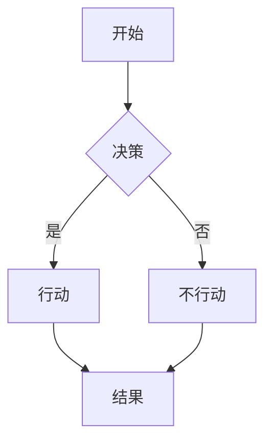

# Advanced Slides 插件演示

这个文件展示了 Obsidian 中 Advanced Slides 插件的功能和用法，可以直接用作幻灯片演示。

---

## 基本介绍

Advanced Slides 是 Obsidian 中强大的演示文稿创建工具，基于 [Reveal.js](https://revealjs.com/)。

使用 Markdown 语法创建专业级幻灯片演示！

---

## 基本用法

1. 使用 `---` 分隔幻灯片
2. 使用 `--` 创建垂直幻灯片
3. 点击右下角的 "Open as Slides" 按钮预览

注: 在编辑器右上角也有幻灯片按钮可快速预览

---

## 文本格式

支持所有标准 Markdown 格式：

- **粗体文本**
- *斜体文本*
- ~~删除线~~
- ==高亮文本==
- [[内部链接]]
- [外部链接](https://obsidian.md)

---

## 列表和引用

### 无序列表
- 项目 1
- 项目 2
  - 子项目 A
  - 子项目 B

### 有序列表
1. 第一步
2. 第二步
3. 第三步

> 这是一个引用块

---

## 代码块

```javascript
function hello() {
  console.log("Hello, Advanced Slides!");
}
```

支持代码高亮！

---

## 表格支持

| 特性 | 描述 | 难度 |
| --- | --- | --- |
| 基本布局 | 幻灯片布局结构 | 简单 |
| 主题 | 预设和自定义主题 | 中等 |
| 动画 | 元素动画和转场 | 高级 |

---

## 图片和图表


---

## Mermaid 图表支持



---

## 数学公式支持

使用 $\LaTeX$ 插入公式：

$$
E = mc^2
$$

$$
\frac{d}{dx}e^x = e^x
$$

---

## 幻灯片注释

<!-- 这是一条不会显示在幻灯片中的注释 -->

注: 可以为演讲者添加笔记
note: 这是演讲者笔记，只有演讲者可见

---

## 布局控制

<!-- slide 支持多种布局 -->

:::columns
:::: column
左侧内容
- 第一点
- 第二点
::::

:::: column
右侧内容
1. 首先
2. 其次
::::
:::

---

## 背景设置

<!-- slide bg="https://source.unsplash.com/1600x900/?nature" -->

## 自定义背景

可以设置图片、颜色或渐变作为背景

---

<!-- slide bg="#A7C5BD" -->

## 颜色背景

不同的颜色可以强调不同的部分

---

## 分段显示

<!-- slide -->

- 点击后显示第一点 <!-- element class="fragment" -->
- 点击后显示第二点 <!-- element class="fragment" -->
- 点击后显示第三点 <!-- element class="fragment" -->

---

## 动画效果

- 淡入效果 <!-- element class="fragment fade-in" -->
- 向上淡入 <!-- element class="fragment fade-up" -->
- 向右淡入 <!-- element class="fragment fade-right" -->

---

## 强调动画

突出显示 <!-- element class="fragment highlight-red" -->

变淡效果 <!-- element class="fragment fade-out" -->

---

## 转场效果

<!-- slide transition="zoom" -->

### 缩放转场

<!-- slide transition="fade" -->

### 淡入淡出

<!-- slide transition="slide" -->

### 滑动效果

---

## 主题设置

Advanced Slides 提供多种内置主题：

- 简单
- 黑色
- 白色
- 联盟
- 月亮
- 太阳花

---

## 自定义 CSS

可以使用CSS片段自定义样式：

```css
.slide {
  background-color: #f5f5f5;
}
.slide h1 {
  color: #1a5dad;
}
```

存储在 `.obsidian/snippets/` 文件夹

---

## 导出选项

- 导出为 PDF
- 导出为 HTML
- 导出为独立 HTML 文件
- 打印幻灯片

---

## 演讲者视图

按 `S` 键打开演讲者视图，包含：

- 当前和下一张幻灯片预览
- 演讲者笔记
- 计时器
- 放大和缩小控制

---

## 交互式元素

可以嵌入交互元素：

- 复选框
- [x] 已完成任务
- [ ] 未完成任务

---

## 幻灯片网格导航

按 `O` 键切换幻灯片网格概览

按 `ESC` 键进入概览模式

---

## 自动播放

设置自动播放和循环播放：

```yaml
---
presentation:
  autoSlide: 5000
  loop: true
---
```

---

## YAML 前置元数据

```yaml
---
theme: moon
transition: slide
highlight: monokai
autoSlide: 5000
controls: true
progress: true
---
```

---

## 自定义尺寸

```yaml
---
height: 800
width: 1400
margin: 0.1
---
```

适配不同的屏幕和投影需求

---

## 高级功能：分屏模式

:::split
左侧内容

:::

:::split
右侧内容
- 第一点
- 第二点
:::

---

## 元素类控制

段落 <!-- element class="align-left" -->

居中 <!-- element class="align-center" -->

右对齐 <!-- element class="align-right" -->

---

## 幻灯片内导航

点击数字导航到指定幻灯片：

[点击前往第一张幻灯片](#/0)

[点击前往"基本用法"](#/2)

---

## 实用快捷键

- `F` - 全屏
- `ESC` - 概览
- `S` - 演讲者视图
- `B` 或 `.` - 暂停(黑屏)
- `Alt+点击` - 放大

---

## 如何使用本演示

1. 安装 Advanced Slides 插件
2. 复制此文件内容
3. 点击预览幻灯片按钮
4. 享受专业演示体验！

---

<!-- slide class="thank-you" -->

# 谢谢观看!

有任何问题欢迎讨论
